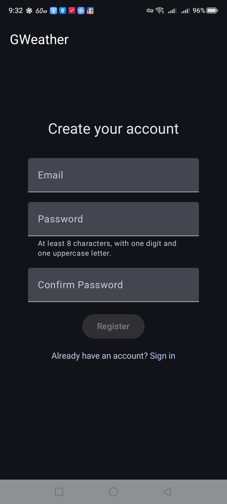
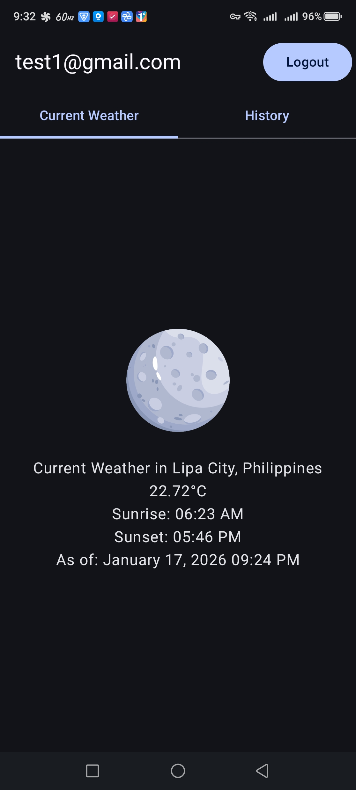
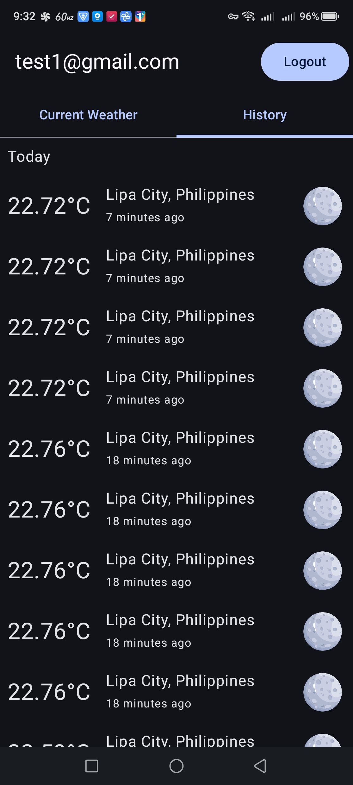

# GWeather

## Setup

1.  Update `local.properties` with your OpenWeather API key:

    ```
    apiKey=YOUR_OPEN_WEATHER_API_KEY
    ```

## Screenshots

| Register                       | Login                    |
|--------------------------------|--------------------------|
|  |  |

| Current Weather                      | History                      |
|--------------------------------------|------------------------------|
|  |  |

## Architecture

This project follows the CLEAN-MVVM architecture, which separates the app into three distinct layers:

*   **Domain Layer**: Contains the core business logic of the app, including use cases, models, and repository interfaces. This layer is independent of any specific framework or platform.
*   **Data Layer**: Responsible for providing data to the domain layer. It includes implementations of the repository interfaces, as well as local and remote data sources.
*   **Presentation Layer**: The UI of the app, which is built using Jetpack Compose. This layer is responsible for displaying data to the user and handling user interactions.

## Major SDKs and Libraries

*   [Jetpack Compose](https://developer.android.com/jetpack/compose) for building the UI
*   [Hilt](https://dagger.dev/hilt/) for dependency injection
*   [Room](https://developer.android.com/training/data-storage/room) for local database storage
*   [Retrofit](https://square.github.io/retrofit/) for networking
*   [Paging 3](https://developer.android.com/topic/libraries/architecture/paging/v3-overview) for paginating data from the local database
*   [MockK](https://mockk.io/) for mocking in unit tests
*   [Truth](https://truth.dev/) for assertions in unit tests

## Local Authentication

The login and registration flow is currently local for testing purposes only.

## Location and Weather Data Flow

1.  The app requests location permissions from the user.
2.  The app checks if the location service is enabled and prompts the user to enable it if it's not.
3.  Once the location is available, the app uses the `Geocoder` to get the city and country.
4.  The app then uses the city and country to fetch the current weather from the OpenWeather API.
5.  The weather data is then saved to the local database and displayed on the screen.
